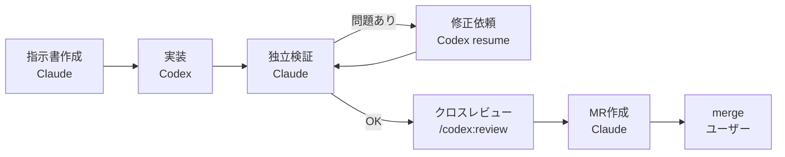

# AI協業開発ガイド（Claude Code × Codex）

## 目的

このドキュメントは、Claude CodeとCodexの役割分担と、1タスクを完了させるまでの開発ループを定義するものです。

Codex単独で開発していた期間は、仕様とのズレや不具合の検証に時間がかかり、環境トラブルでも作業が止まりがちでした。そこで今後は、実装した本人とは別のエージェントが受け入れ判定を行う形にし、品質をそこで担保します。

## 役割分担

| 担当 | 役割 |
| --- | --- |
| ユーザー | 最終的な意思決定、MRの承認とmerge、秘密値の管理（Vercel、Neon等）、`/codex:review`・`/codex:adversarial-review`の実行 |
| Claude Code | ロードマップの解釈、設計判断、タスク指示書の作成、Codexへの依頼、差分レビュー、検証コマンドと画面確認の実行、ドキュメント更新、完了判定 |
| Codex | タスク指示書の範囲内での実装、バグ修正、原因調査、検証結果の報告 |

Claude CodeからCodexへの依頼は、codexプラグインの `codex:codex-rescue` サブエージェントを通じて行います。

## 開発ループ（1タスク = 1MR）



1. **指示書作成（Claude）**: 下記テンプレートでタスク指示書を作成する。1MRで完了できない大きさであれば分割する。
2. **実装（Codex）**: 指示書を渡して実装を依頼する。
3. **独立検証（Claude）**: `git diff` をレビューし、検証コマンドを自分で実行する。画面に影響する変更は、ブラウザでADMIN、MANAGER、MEMBERの3ロールで確認する。Codexの報告だけで完了と判定しない。
4. **修正（Codex）**: 問題があれば、同じCodexスレッドを再開して修正を依頼する。
5. **クロスレビュー**: ユーザーが `/codex:review` を実行する。設計に関わる大きな変更では `/codex:adversarial-review` を実行する。Claudeが指摘事項を対応要否で仕分ける。
6. **MR作成（Claude）**: `git pull --rebase` の後にpushし、日本語でMRを作成する。mergeはユーザーが行う。

## タスク指示書テンプレート

```markdown
# タスク: <短い名前>

## 背景・目的
<なぜ必要か。関連するPhaseと完了条件>

## 対象範囲
- 変更してよいファイル・モジュール: <例: src/modules/members/>
- 参照すべきドキュメント: <例: docs/CSV_PERMISSION_AUDIT.md の「RBAC」節>

## 仕様
<期待する振る舞い。入力、出力、権限、エラー時の挙動>

## 受け入れ条件
- [ ] <観測可能な条件1>
- [ ] <観測可能な条件2>

## 禁止事項
- 対象範囲外のリファクタリング、依存パッケージの追加、デザイン変更
- DB migration: <要 / 不要>

## 検証コマンド
- npm.cmd run verify
- npm.cmd run verify -- --skip=migrate（schemaを変更しない場合）

## 報告してほしいこと
変更ファイル、実行したコマンドと結果（失敗も含む）、未対応事項、判断に迷った点
```

## 完了の定義（Definition of Done）

- タスク指示書の受け入れ条件をすべて満たしている。
- `npm.cmd run verify` がClaudeの手元で成功している。schemaを変更しない場合は `-- --skip=migrate` を指定してよい。
- 振る舞いを変えた業務ロジックにユニットテストがある。
- 画面に影響する変更は、3ロールでの画面確認結果がMRに記載されている。
- API仕様を変えた場合は `docs/api/openapi.yaml` を更新している。
- 設計判断や運用ルールの変更は、関連ドキュメントに反映されている。
