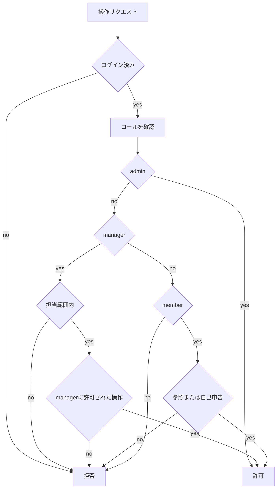
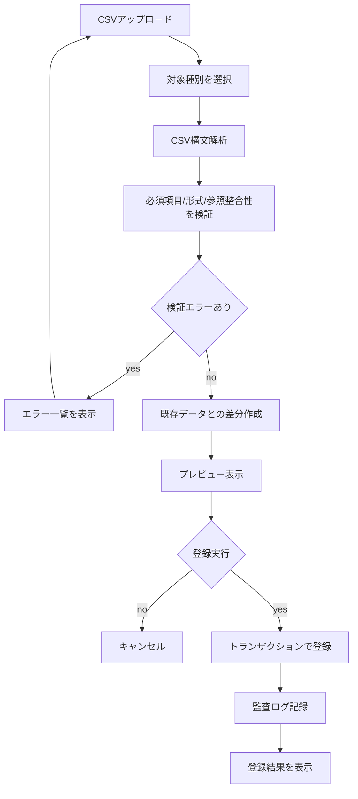
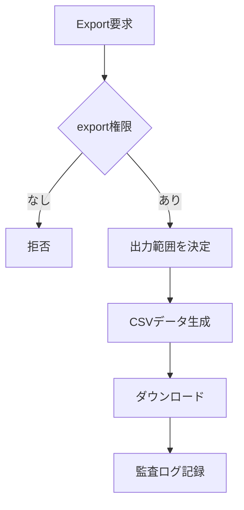

# CSV・権限・監査設計

## 目的

このドキュメントは、権限ロール、CSV import/export仕様、監査ログ方針を定義します。

初期リリースでは、CSV対象を主要マスタに限定し、AI評価は監査対象の将来候補としてのみ扱います。

## 権限ロール

初期ロールは `admin`、`manager`、`member` の3種類です。画面とAPIの両方で同じ権限判定を適用します。

| 操作 | `admin` | `manager` | `member` |
| --- | --- | --- | --- |
| ダッシュボード閲覧 | 可 | 可 | 可 |
| メンバー閲覧 | 可 | 可 | 可 |
| メンバー作成 | 可 | 不可 | 不可 |
| メンバー更新 | 可 | 担当範囲のみ可 | 不可 |
| メンバー削除/無効化 | 可 | 不可 | 不可 |
| スキル閲覧 | 可 | 可 | 可 |
| スキル作成/更新/無効化 | 可 | 不可 | 不可 |
| 自分のスキル申告 | 可 | 可 | 可 |
| 申告スキルの承認・補正 | 可 | 担当範囲のみ可 | 不可 |
| 承認済みメンバースキルの直接更新 | 可 | 不可 | 不可 |
| ロール閲覧 | 可 | 可 | 可 |
| ロール作成/更新/無効化 | 可 | 不可 | 不可 |
| 通知閲覧 | 可 | 自分宛のみ可 | 自分宛のみ可 |
| CSV export | 可 | 担当範囲のみ可 | 不可 |
| CSV import | 可 | 不可 | 不可 |
| 監査ログ閲覧 | 可 | 不可 | 不可 |
| 権限変更 | 可 | 不可 | 不可 |

権限判断は以下の流れで行います。

## CSV対象

初期リリースのCSV import/export対象は主要マスタに限定します。

| 対象 | Import | Export | 用途 |
| --- | --- | --- | --- |
| 部署 | 可 | 可 | 部署マスタの初期登録、更新 |
| メンバー | 可 | 可 | メンバー基本情報の一括登録、更新 |
| スキル | 可 | 可 | スキルマスタの初期登録、更新 |
| メンバースキル | 可 | 可 | 承認済みメンバー別スキル、レベルの一括登録、更新 |
| ロール | 後続 | 可 | 初期は画面編集を主とする |
| ロール要件 | 後続 | 可 | 初期は画面編集を主とする |
| 監査ログ | 不可 | 可 | `admin` の確認、調査用 |
| AI評価 | 対象外 | 対象外 | Phase 6で再設計 |

## CSV項目

### 部署CSV

| 項目 | 必須 | 説明 |
| --- | --- | --- |
| `department_code` | 必須 | 部署コード。一意 |
| `department_name` | 必須 | 部署名 |
| `parent_department_code` | 任意 | 親部署コード |
| `is_active` | 必須 | `true` または `false` |

### メンバーCSV

| 項目 | 必須 | 説明 |
| --- | --- | --- |
| `employee_no` | 必須 | 社員番号。一意 |
| `name` | 必須 | 氏名 |
| `email` | 必須 | メールアドレス。一意 |
| `department_code` | 必須 | 所属部署コード |
| `job_title` | 任意 | 役職、職種 |
| `status` | 必須 | `active`、`inactive`、`leave` |

### スキルCSV

| 項目 | 必須 | 説明 |
| --- | --- | --- |
| `skill_code` | 必須 | スキルコード。一意 |
| `skill_name` | 必須 | スキル名 |
| `category_name` | 必須 | スキルカテゴリ名 |
| `description` | 任意 | 説明 |
| `is_active` | 必須 | `true` または `false` |

### メンバースキルCSV

| 項目 | 必須 | 説明 |
| --- | --- | --- |
| `employee_no` | 必須 | 社員番号 |
| `skill_code` | 必須 | スキルコード |
| `level` | 必須 | 1から5 |
| `years_of_experience` | 任意 | 経験年数 |
| `last_assessed_at` | 任意 | 最終評価日。`YYYY-MM-DD` |

## CSV import処理

CSV importは即時登録せず、アップロード、検証、プレビュー、差分確認、登録の順で進めます。

検証方針は以下です。

- 必須項目が空の場合はエラーにする。
- 一意制約に違反する場合はエラーにする。
- 参照先の部署、メンバー、スキルが存在しない場合はエラーにする。
- スキルレベルが1から5以外の場合はエラーにする。
- 同一CSV内でキーが重複する場合はエラーにする。
- 既存データとの差分は、新規、更新、変更なしに分類する。

## CSV export処理

CSV exportは権限範囲内のデータだけを出力します。`manager` は担当範囲に限定し、`member` はexportできません。

## 監査ログ方針

監査ログは、誰が、いつ、何を、どの対象に対して行ったかを追跡できる粒度で記録します。

| 記録対象 | 操作 | 記録内容 |
| --- | --- | --- |
| メンバー | 作成、更新、無効化 | actor、target、変更前後の差分、発生日時 |
| 部署 | 作成、更新、無効化 | actor、target、変更前後の差分、発生日時 |
| スキル | 作成、更新、無効化 | actor、target、変更前後の差分、発生日時 |
| スキル申告 | 作成、再申告 | actor、target、申告内容、発生日時 |
| 申告スキル承認 | 承認、補正承認、差し戻し | actor、target、申告内容、補正内容、コメント、発生日時 |
| メンバースキル | 作成、更新、削除 | actor、target、変更前後の差分、承認元、発生日時 |
| 通知 | 作成、既読 | recipient、通知種別、関連対象、発生日時 |
| ロール | 作成、更新、無効化 | actor、target、変更前後の差分、発生日時 |
| CSV import | 検証、登録、失敗 | actor、対象種別、件数、エラー概要、発生日時 |
| CSV export | 出力 | actor、対象種別、件数、出力範囲、発生日時 |
| 権限 | 付与、変更、剥奪 | actor、target user、変更前後のロール、発生日時 |
| AI評価 | 後続 | Phase 6で実行、再評価、失敗、利用ログを設計する |

監査ログの保持方針は以下です。

- 初期方針として最低1年間保持する。
- 個人情報を含む差分は必要最小限にする。
- 監査ログ自体の更新、削除は通常画面から行わない。
- CSV importの元ファイル保持期間はPhase 5の実装時に再検討する。
