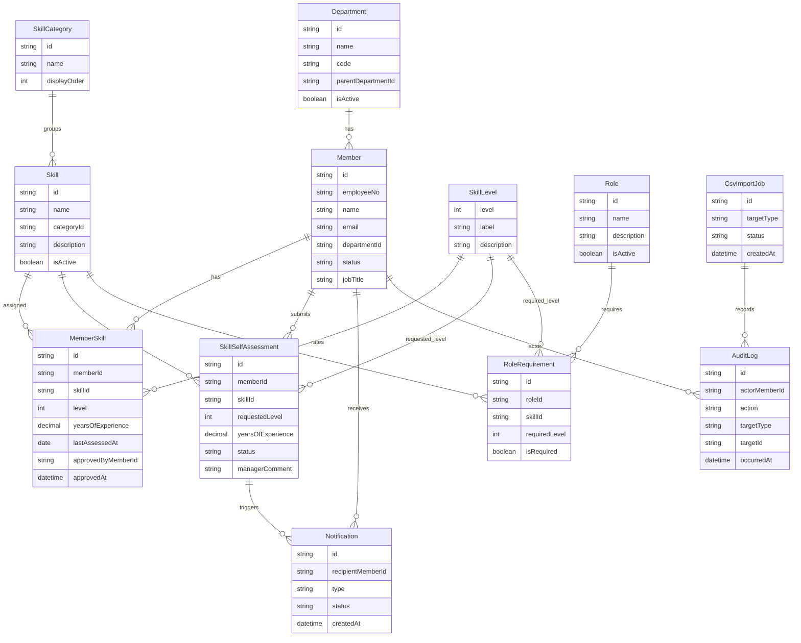
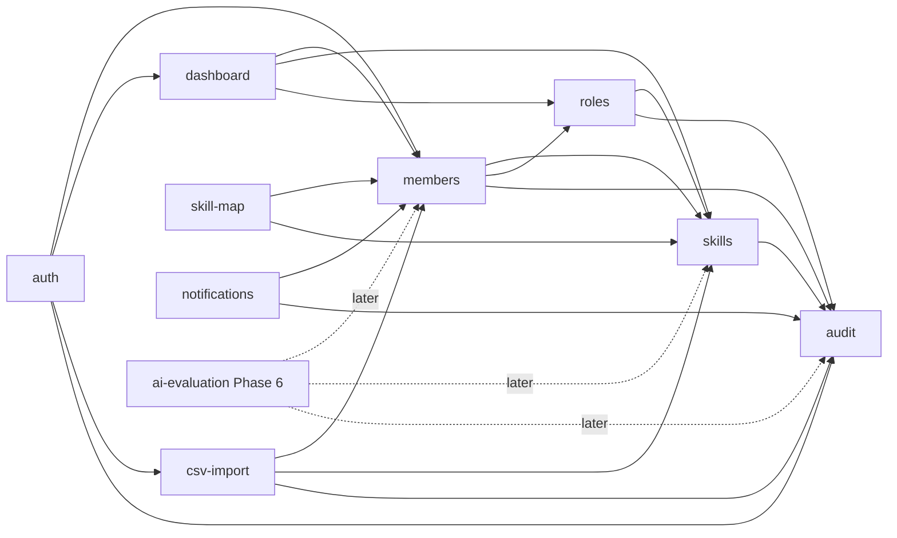

# ドメイン設計

## 目的

このドキュメントは、初期リリースの業務範囲、ドメインモデル、モジュール境界、主要ユースケースを定義します。

Phase 2以降のDB設計、画面設計、実装設計はこの内容を前提に進めます。

## 初期リリース範囲

初期リリースでは、メンバーのスキル情報を正しく登録し、検索、可視化、ロール達成状況の確認までを可能にします。

| 区分 | 初期リリースに含めるもの |
| --- | --- |
| メンバー管理 | メンバー基本情報、部署、在籍状態、プロフィール、検索 |
| スキル管理 | スキル、カテゴリ、スキルレベル定義 |
| スキル紐付け | メンバー自身によるスキル申告、managerによる承認・補正、確定済み保有スキル |
| ロール管理 | ロール、必要スキル、必要レベル、達成判定 |
| 可視化 | スキル検索、スキルマップ、統計ダッシュボード |
| CSV | 部署、メンバー、スキル、メンバースキルのimport/export |
| 権限 | `admin`、`manager`、`member` のRBAC |
| 通知 | スキル申告、承認依頼、承認結果の通知 |
| 監査 | 作成、更新、削除、承認・差し戻し、CSV import/export、権限変更の記録 |

以下は初期リリースには含めません。

- AI評価の実行、再評価、キャッシュ、利用ログ。
- CSVによるロール要件の一括import。
- 承認フロー付きCSV import。
- 外部人事システム連携。

AI評価は `ai-evaluation` モジュールとしてPhase 6で再設計します。初期リリースではDBや画面にAI評価結果を必須項目として持たせません。

## ドメインモデル

主要なエンティティと関連は以下です。Phase 2のPrisma schemaでは、この関係を基準にテーブル設計へ落とし込みます。

## 主要エンティティ

| エンティティ | 役割 | 主な制約 |
| --- | --- | --- |
| `Department` | 部署、部門、チームなどの所属単位 | `code` は一意。無効化しても過去メンバーとの関連は保持する |
| `Member` | スキル管理対象者 | `employeeNo` と `email` は一意。在籍状態を持つ |
| `SkillCategory` | スキルの分類 | 表示順を持つ |
| `Skill` | 管理対象スキル | 同一カテゴリ内で名称重複を避ける |
| `SkillLevel` | 1から5のレベル定義 | 初期値は固定マスタとして扱う |
| `MemberSkill` | 承認済みのメンバーとスキルの紐付け | `memberId` と `skillId` の組み合わせは一意。manager承認後の値を保持する |
| `SkillSelfAssessment` | メンバー自身が申告したスキル更新依頼 | `pending`、`approved`、`corrected`、`rejected` の状態を持つ |
| `Notification` | ユーザーへの業務通知 | 承認依頼、承認結果、差し戻しを通知する |
| `Role` | 職務、期待役割、キャリアロール | 無効化しても過去判定の参照は可能にする |
| `RoleRequirement` | ロール達成に必要なスキル条件 | `roleId` と `skillId` の組み合わせは一意 |
| `AuditLog` | 重要操作の履歴 | 業務データから直接更新しない |
| `CsvImportJob` | CSV importの実行単位 | プレビュー、検証、登録結果の追跡に使う |

## スキルレベル

MVPの方針を継承し、スキルレベルは1から5で表現します。

| レベル | ラベル | 意味 |
| --- | --- | --- |
| 1 | Beginner | 基本概念を理解し、支援を受けて作業できる |
| 2 | Basic | 定型作業を自力で進められる |
| 3 | Intermediate | 通常業務で実用でき、周囲へ説明できる |
| 4 | Advanced | 複雑な課題を解決し、設計や改善を主導できる |
| 5 | Expert | 組織横断で標準化、育成、技術判断をリードできる |

## モジュール境界

初期リリース時点の業務境界は以下です。モジュール間連携は公開されたuse caseまたはservice経由に限定し、他モジュールのinfrastructure層へ直接依存しません。

| モジュール | 初期リリースでの責務 |
| --- | --- |
| `members` | メンバー、部署、在籍状態、メンバースキルのユースケース |
| `skills` | スキル、カテゴリ、レベル定義、スキル検索のユースケース |
| `roles` | ロール、ロール要件、達成判定のユースケース |
| `skill-map` | メンバーとスキルのマトリクス表示用データ取得 |
| `dashboard` | 統計、未設定、ロール達成状況などの集計 |
| `csv-import` | CSVの検証、プレビュー、差分、登録、export |
| `auth` | 認証済みユーザー、RBAC、操作可否判定 |
| `audit` | 重要操作の記録、検索、保持方針 |
| `notifications` | スキル申告、承認依頼、承認結果の通知 |
| `ai-evaluation` | Phase 6で扱う後続モジュール。初期リリースでは実装しない |

## 主要ユースケース

| ユースケース | 主体 | 概要 |
| --- | --- | --- |
| メンバーを登録する | `admin` | 社員番号、氏名、メール、部署、在籍状態を登録する |
| メンバー情報を更新する | `admin`、`manager` | 基本情報や所属を更新する。`manager` は担当範囲に限定する |
| スキルを登録する | `admin` | カテゴリ、名称、説明を登録する |
| 自分のスキルを申告する | `member` | 自身のスキル、レベル、経験年数を申告し、managerへ承認依頼を送る |
| 申告スキルを承認・補正する | `manager` | 担当範囲の申告内容を確認し、承認、補正承認、差し戻しを行う |
| メンバーにスキルを直接紐付ける | `admin` | 初期整備や例外対応として、承認済みスキルを直接登録する |
| ロールを定義する | `admin` | ロール名と必要スキル条件を登録する |
| ロール達成状況を確認する | `admin`、`manager`、`member` | メンバーの保有スキルとロール要件を比較する |
| スキルでメンバーを検索する | `admin`、`manager`、`member` | スキル、レベル、部署などで対象者を検索する。`member` は公開範囲に限定する |
| スキルマップを確認する | `admin`、`manager`、`member` | 部署やスキルカテゴリ単位で分布を確認する。`member` は公開範囲に限定する |
| 通知を確認する | `admin`、`manager`、`member` | 承認依頼、承認結果、差し戻し通知を確認する |
| CSVをimportする | `admin` | 主要マスタの一括登録、更新をプレビュー後に実行する |
| CSVをexportする | `admin`、`manager` | 権限範囲内の主要マスタを出力する |
| 監査ログを確認する | `admin` | 重要操作の履歴を検索、確認する |

## 実装設計への引き渡し

Phase 2では、このドメイン設計をもとに以下を具体化します。

- Prisma schema。
- Zod schemaと入力DTO。
- 初期seedデータ。
- domain/application/infrastructure/presentationの配置。
- Auth.jsとRBACの技術実装。
