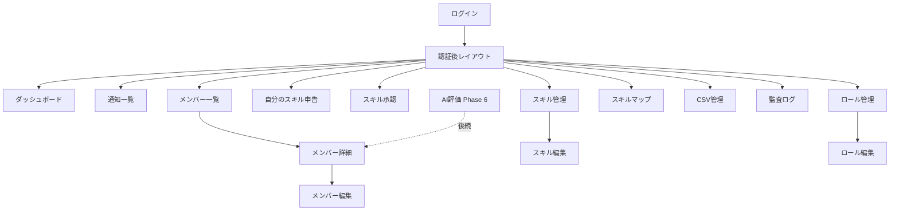
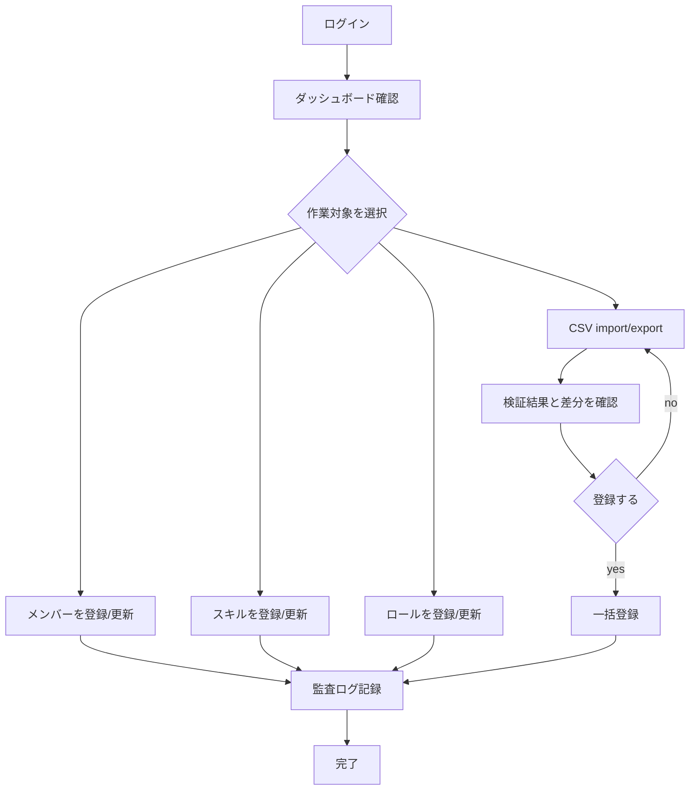
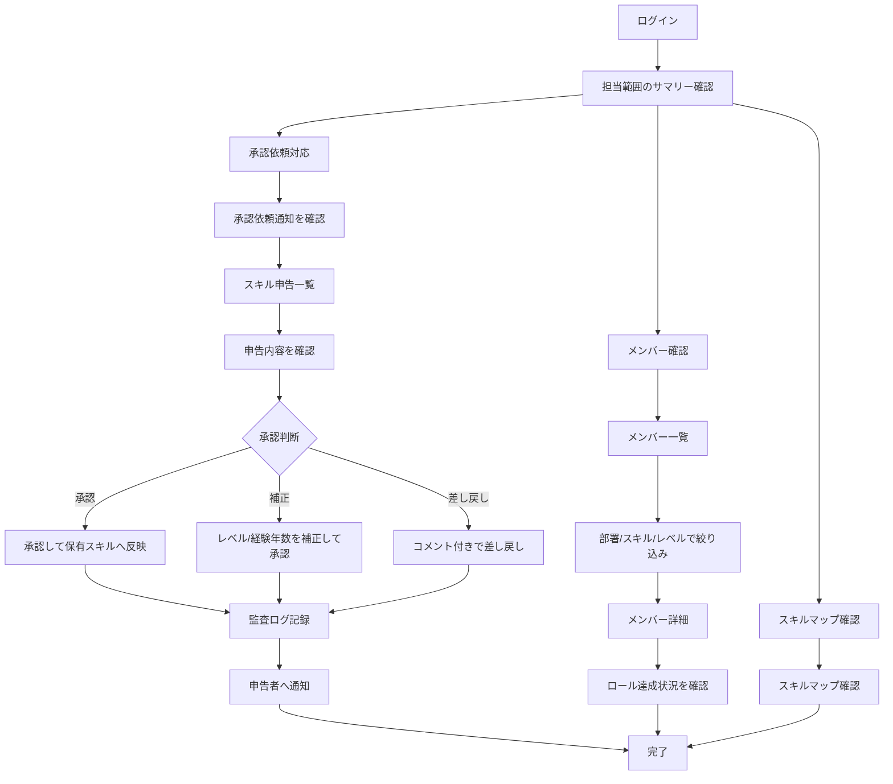
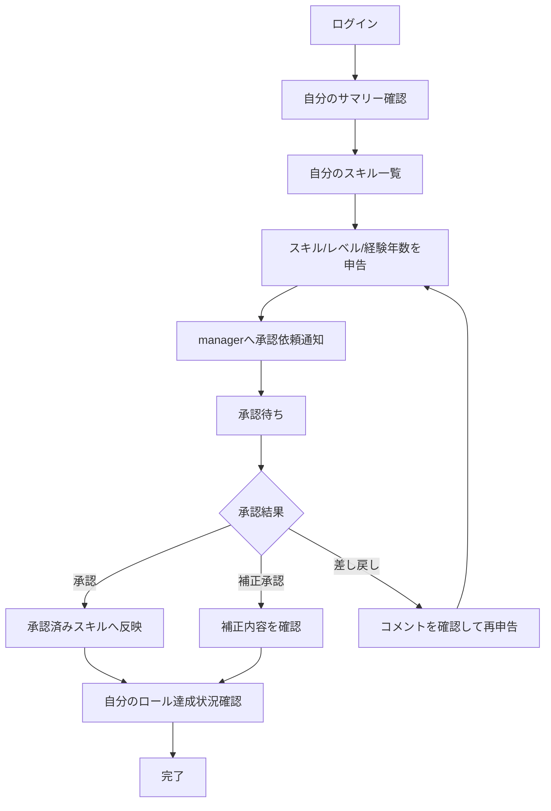
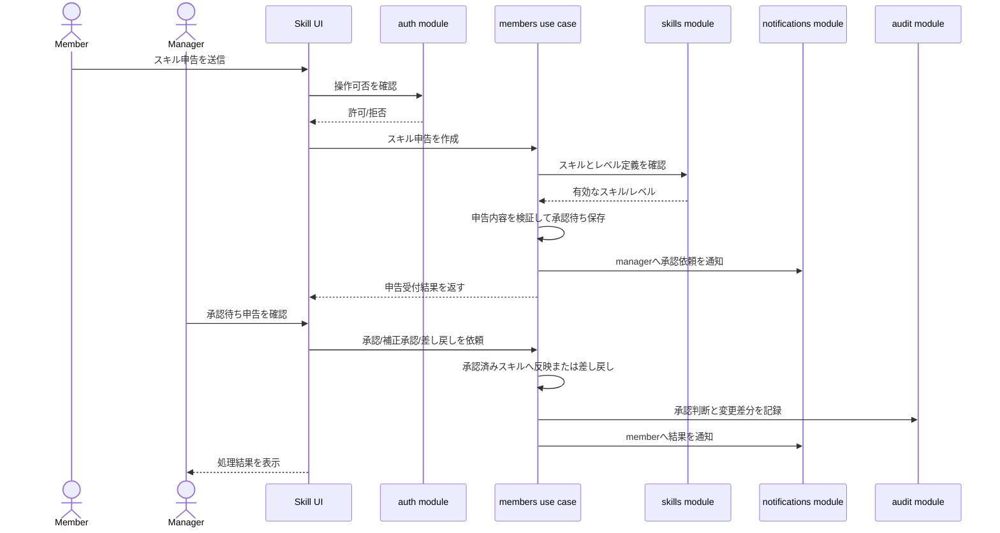

# 画面一覧とユーザーフロー

## 目的

このドキュメントは、初期リリースの画面一覧と主要ユーザーフローを整理します。

フローはGitLab Markdownで閲覧できるように、標準的なMermaid記法で記述します。

## 画面一覧

| 画面 | パス案 | 主な利用者 | 初期リリース | 概要 |
| --- | --- | --- | --- | --- |
| ログイン | `/login` | 全ロール | 含める | Auth.jsによるログイン導線 |
| ダッシュボード | `/dashboard` | 全ロール | 含める | メンバー数、スキル数、未設定、ロール達成状況 |
| 通知一覧 | `/notifications` | 全ロール | 含める | 承認依頼、承認結果、差し戻しの確認 |
| メンバー一覧 | `/members` | 全ロール | 含める | 検索、部署フィルタ、スキル条件検索 |
| メンバー詳細 | `/members/[id]` | 全ロール | 含める | 基本情報、保有スキル、ロール達成状況 |
| メンバー編集 | `/members/[id]/edit` | `admin`、`manager` | 含める | 基本情報と所属の編集 |
| 自分のスキル申告 | `/my/skills` | `member`、`manager`、`admin` | 含める | 自身のスキル、レベル、経験年数の申告 |
| スキル承認 | `/skill-approvals` | `manager`、`admin` | 含める | 申告スキルの承認、補正承認、差し戻し |
| スキル管理 | `/skills` | `admin`、`manager`、`member` | 含める | スキル一覧、カテゴリ、レベル説明 |
| スキル編集 | `/skills/[id]/edit` | `admin` | 含める | スキル定義の作成、更新、無効化 |
| ロール管理 | `/roles` | 全ロール | 含める | ロール一覧、必要スキル、達成判定 |
| ロール編集 | `/roles/[id]/edit` | `admin` | 含める | ロールと必要スキル条件の編集 |
| スキルマップ | `/skill-map` | 全ロール | 含める | メンバー x スキルのマトリクス |
| CSV管理 | `/csv` | `admin`、`manager` | 含める | import/export、プレビュー、差分確認 |
| 監査ログ | `/audit-logs` | `admin` | 含める | 操作履歴の検索、確認 |
| AI評価 | `/ai-evaluation` | 未定 | 後続 | Phase 6で再設計 |

## 画面構成

初期リリースの主要画面は、認証後のアプリケーション領域に配置します。AI評価は初期ナビゲーションに置きません。

## `admin` ユーザーフロー

`admin` は初期データ整備、マスタ管理、CSV import、監査ログ確認を担当します。

## `manager` ユーザーフロー

`manager` は担当範囲のメンバー確認、スキル申告の承認・補正、検索、可視化を主に利用します。

## `member` ユーザーフロー

`member` は自分のスキル申告を行い、承認状況や承認済みスキルを確認します。マスタ更新、CSV import、監査ログ閲覧は行えません。

## スキル申告・承認シーケンス

メンバースキルは、原則としてメンバー自身の申告を起点にし、managerが承認または補正承認した時点で承認済みスキルへ反映します。

## 初期リリースに含めない画面

| 画面 | 理由 | 後続Phase |
| --- | --- | --- |
| AI評価一覧 | AI評価を初期リリースから外すため | Phase 6 |
| AI再評価操作 | APIキー保護、キャッシュ、利用ログと一体で再設計するため | Phase 6 |
| CSV承認画面 | 初期はプレビューと差分確認までにするため | Phase 5以降で再検討 |
| 外部連携設定 | 初期リリースでは外部人事システム連携を扱わないため | 未定 |
